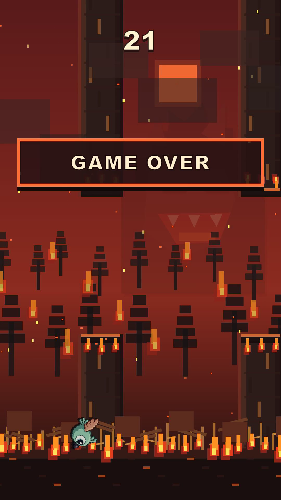

# Agentic Video Maker

Коллекция самостоятельных Codex skills и тематических справочников для создания YouTube Shorts. Общего управляющего skill здесь нет: выбирай формат или инструмент под текущую задачу.

## Skills

| Направление | Skills | Для чего |
|---|---|---|
| Форматы Shorts | `paint95-video-maker`, `paint-full-shorts`, `doodle-jump`, `comics-shorts`, `flappy-bird2` | Самостоятельные визуальные подходы к ролику. |
| Подготовка и сценарий | `social-short-production`, `short-form-video-script`, `scripting-and-storyboarding`, `hook-writer`, `viral-short-form`, `youtube-shorts` | От идеи и хука до сценария и структуры короткого ролика. |
| Монтаж и звук | `editing-montage`, `ffmpeg-video-editor`, `premiere-pro-audio-shorts-cutter`, `audio-mixing-mastering`, `dialogue-editing-adr` | Монтаж, работа с речью, музыкой и звуковым балансом. |
| Титры и оформление | `captions-and-clipping`, `cinematic-typography`, `typography-editor` | Нарезка, субтитры и экранная типографика. |
| Разбор и QC | `reference-media-analysis`, `media-qc-delivery`, `watch` | Анализ референсов, проверка и подготовка результата. |
| Remotion | [`remotion-photo-techniques`](skills/remotion-photo-techniques/SKILL.md), `remotion-*` | Создание, анимация, captions, мультимедиа, предпросмотр и рендер. |
| Вспомогательные | `cringe-meme` | Подбор мемной реакции. |

Каждая папка в [`skills/`](skills/) содержит свой `SKILL.md` и связанные ресурсы. Выбирай подходящий skill напрямую, например `$ffmpeg-video-editor`; общей последовательности, которая выбирает и вызывает остальные, нет. Для skills с визуальными карточками обновляй их через `scripts/generate-skill-overviews.mjs`.

## Пример конечного результата

Ниже — точный последний кадр готового 39,2-секундного Shorts, созданного с `flappy-bird2`. Это игровой финал с экраном GAME OVER, извлечённый из кадра 1175 мастера (1080×1920, 30 fps).

  

## Документы

- [`docs/README.md`](docs/README.md) — указатель по темам и этапам.
- [`docs/photo-techniques/index.html`](docs/photo-techniques/index.html) — интерактивный каталог 29 Remotion-приёмов с видео-превью.
- [`docs/png-delivery.md`](docs/png-delivery.md) — когда и какое PNG-превью прикладывать к результату.
- [`docs/chatgpt-video-review.md`](docs/chatgpt-video-review.md) — промпт для необязательной проверки монтажа готового видео в браузерном ChatGPT.
- [`docs/stop-motion/`](docs/stop-motion/) — полная тематическая база: поиск источников, сцена, движение, покадровая работа и QC.
- [`docs/paint-editor/`](docs/paint-editor/) — концепция редакторного повествования и toolkit.

Для нового Shorts-проекта открывай один форматный skill и подключай только те справочники, которые нужны текущему этапу. Документы — reference, а не дополнительные инструкции агента.
