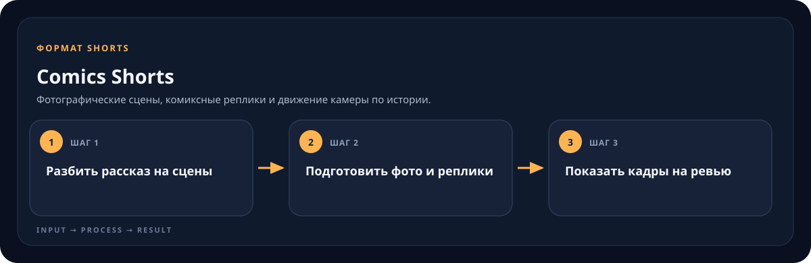

<!-- generated by scripts/generate-skill-overviews.mjs -->

# Comics Shorts

*Подготовленный фотографический кадр из проекта Vasco da Gama (Comics Shorts).*

Фотографические сцены, комиксные реплики и движение камеры по истории.

*Схема показывает назначение и ход работы скилла; это не скриншот готового результата.*

**Когда использовать:** Нужен короткий рассказ в виде последовательности реалистичных кадров с комиксными облачками.

**На входе:** Аудио или сценарий, герои и визуальные ограничения.

**Результат:** Проверенный пакет кадров для ревью, затем смонтированный вертикальный ролик.

**Инструкции:** [SKILL.md](SKILL.md)
