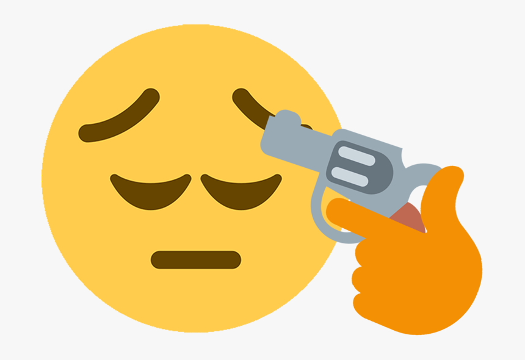
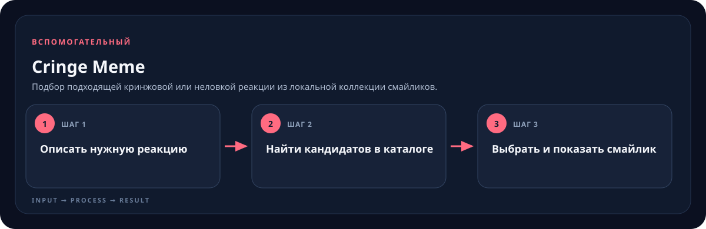

<!-- generated by scripts/generate-skill-overviews.mjs -->

# Cringe Meme

*Конкретный ассет из подборки cringe-meme — пример одной из реакций.*

Подбор подходящей кринжовой или неловкой реакции из локальной коллекции смайликов.

*Схема показывает назначение и ход работы скилла; это не скриншот готового результата.*

**Когда использовать:** Нужна реакционная картинка для мема, монтажа или короткого видео.

**На входе:** Сцена, эмоция или желаемый тип реакции.

**Результат:** Выбранный файл смайлика с названием и путём.

**Инструкции:** [SKILL.md](SKILL.md)
