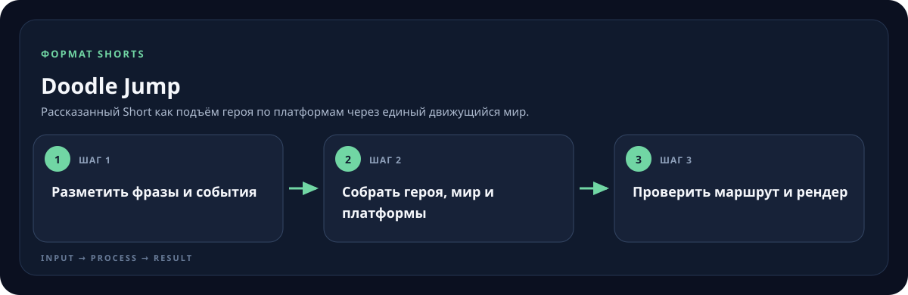

<!-- generated by scripts/generate-skill-overviews.mjs -->

# Doodle Jump

Рассказанный Short как подъём героя по платформам через единый движущийся мир.

*Схема показывает назначение и ход работы скилла; это не скриншот готового результата.*

**Когда использовать:** История подходит для последовательного подъёма, открытий и препятствий.

**На входе:** Озвучка, сценарий, герой и визуальные материалы.

**Результат:** Редактируемый Remotion-проект, MP4 и кадры для QA.

**Инструкции:** [SKILL.md](SKILL.md)
