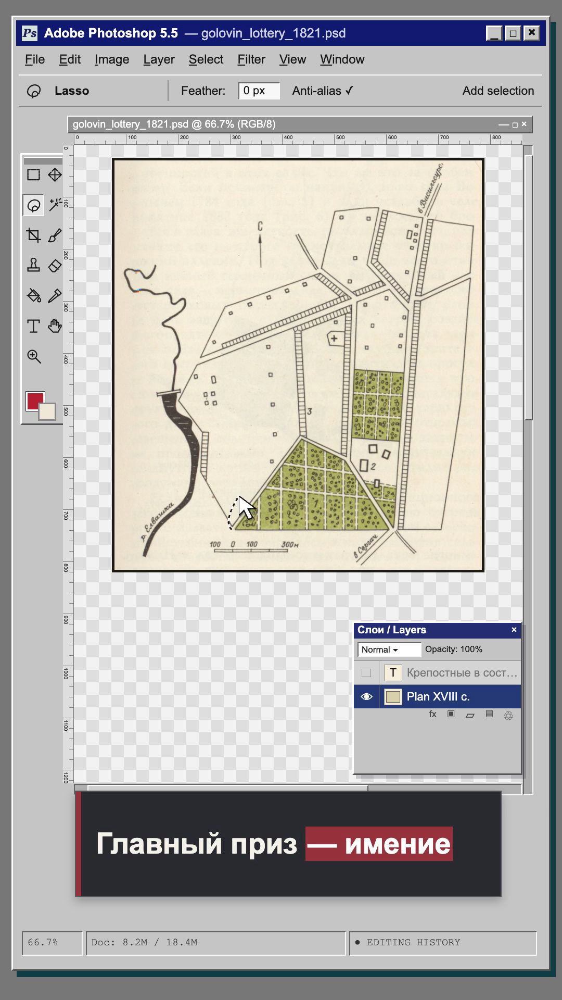
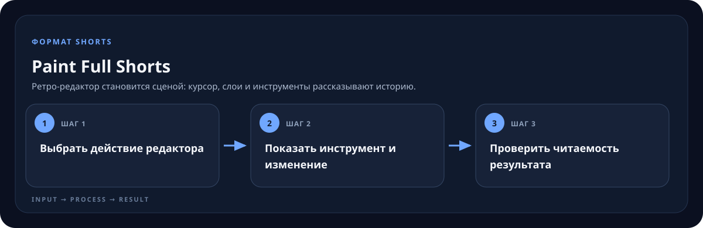

<!-- generated by scripts/generate-skill-overviews.mjs -->

# Paint Full Shorts

*Кадр из финального ролика о лотерее Головина: Photoshop-подобный редактор как сцена истории.*

Ретро-редактор становится сценой: курсор, слои и инструменты рассказывают историю.

*Схема показывает назначение и ход работы скилла; это не скриншот готового результата.*

**Когда использовать:** Смысл ролика можно раскрыть через видимые операции редактирования.

**На входе:** Идея или озвучка, изображения и желаемая операция.

**Результат:** Редактируемый Short с понятной последовательностью действий.

**Инструкции:** [SKILL.md](SKILL.md)
