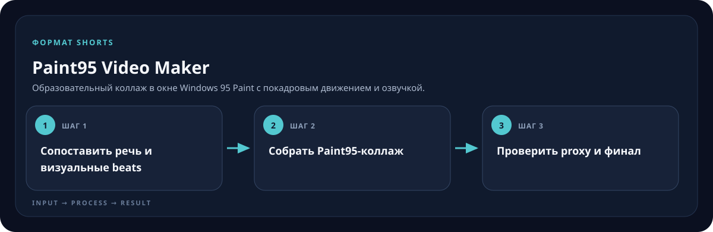

<!-- generated by scripts/generate-skill-overviews.mjs -->

# Paint95 Video Maker

Образовательный коллаж в окне Windows 95 Paint с покадровым движением и озвучкой.

*Схема показывает назначение и ход работы скилла; это не скриншот готового результата.*

**Когда использовать:** Нужен ролик в установленной визуальной стилистике Paint95.

**На входе:** Сценарий или готовое аудио, источники и стиль.

**Результат:** Проверенный MP4, проект, субтитры и контакт-лист.

**Инструкции:** [SKILL.md](SKILL.md)
