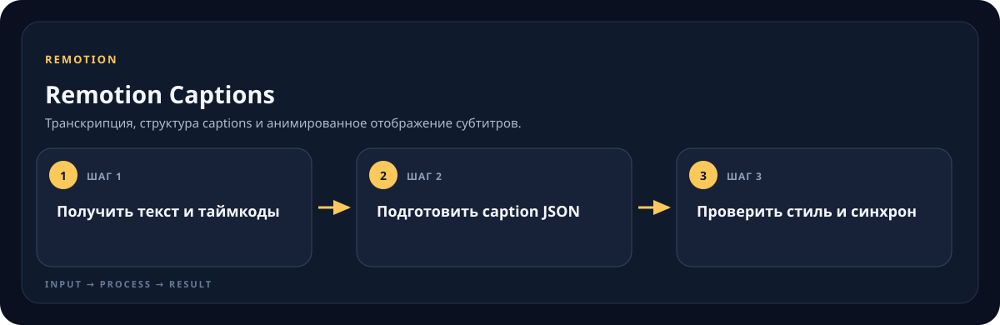

<!-- generated by scripts/generate-skill-overviews.mjs -->

# Remotion Captions

Транскрипция, структура captions и анимированное отображение субтитров.

*Схема показывает назначение и ход работы скилла; это не скриншот готового результата.*

**Когда использовать:** Нужно получить, импортировать или стилизовать подписи для видео.

**На входе:** Аудио/видео или готовый текст и тайминги.

**Результат:** Синхронизированные данные captions и отображение в композиции.

**Инструкции:** [SKILL.md](SKILL.md)
