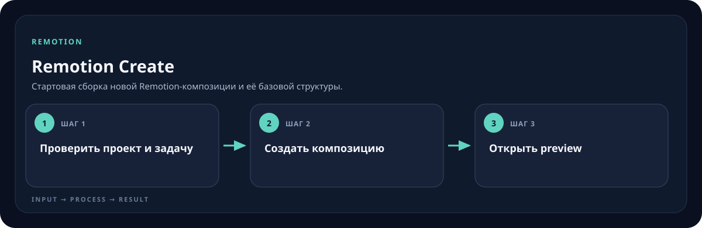

<!-- generated by scripts/generate-skill-overviews.mjs -->

# Remotion Create

Стартовая сборка новой Remotion-композиции и её базовой структуры.

*Схема показывает назначение и ход работы скилла; это не скриншот готового результата.*

**Когда использовать:** Создаётся новый Remotion-проект или композиция.

**На входе:** Задача видео, формат, медиа и окружение проекта.

**Результат:** Рабочий проект с композицией и доступным preview.

**Инструкции:** [SKILL.md](SKILL.md)
