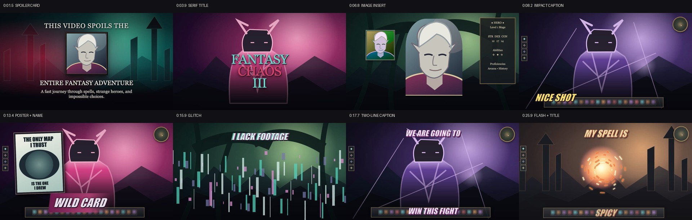

# Видеоприёмы из начала большого ролика: 0:00–0:30

Запускаемый Remotion-проект для первой части [видеореференса](https://www.youtube.com/watch?v=I6qlhmjkQ44). Он показывает портретную вставку, несколько видов титров, глитч, ударные вспышки и рваную рамку в порядке появления в исходнике. Звук отсутствует. Игровые кадры заменены собственным процедурным рисунком, поэтому пример можно хранить и переиспользовать отдельно от исходного видео.

```bash
npm ci
npm run dev
npx remotion render src/index.ts ReviewIntroEffects out/reel.mp4
```

Основные файлы: [переиспользуемые компоненты](src/effects.tsx), [30-секундная композиция](src/Composition.tsx), [покадровый рецепт](effect.md) и [готовое видео-превью](../../assets/previews/review-intro-0000-0030.mp4). Для точного повторения нового отрывка замените фон и иллюстрации своими материалами, сохранив локальные времена и слой титров.


