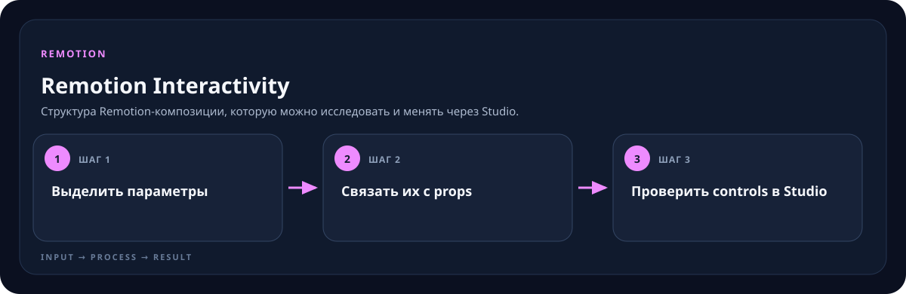

<!-- generated by scripts/generate-skill-overviews.mjs -->

# Remotion Interactivity

Структура Remotion-композиции, которую можно исследовать и менять через Studio.

*Схема показывает назначение и ход работы скилла; это не скриншот готового результата.*

**Когда использовать:** Нужно управлять параметрами, слоями или состояниями из Studio.

**На входе:** Композиция и параметры, которые пользователь должен менять.

**Результат:** Интерактивный preview с читаемыми controls.

**Инструкции:** [SKILL.md](SKILL.md)
