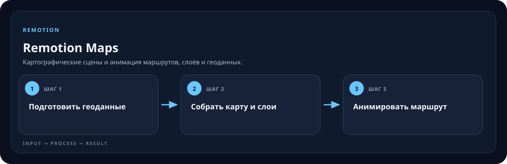

<!-- generated by scripts/generate-skill-overviews.mjs -->

# Remotion Maps

Картографические сцены и анимация маршрутов, слоёв и геоданных.

*Схема показывает назначение и ход работы скилла; это не скриншот готового результата.*

**Когда использовать:** Видео включает карту, географический маршрут или пролёт.

**На входе:** Место, геоданные, стиль карты и движение камеры.

**Результат:** Стабильная картографическая композиция для рендера.

**Инструкции:** [SKILL.md](SKILL.md)
