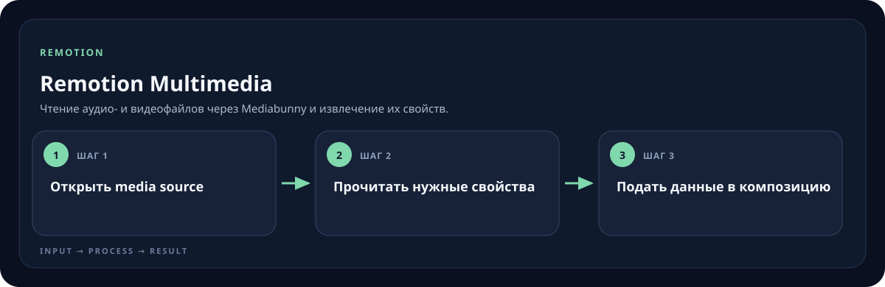

<!-- generated by scripts/generate-skill-overviews.mjs -->

# Remotion Multimedia

Чтение аудио- и видеофайлов через Mediabunny и извлечение их свойств.

*Схема показывает назначение и ход работы скилла; это не скриншот готового результата.*

**Когда использовать:** Нужно проверить длительность, размеры или медиа-данные в браузерном проекте.

**На входе:** Аудио/видео и задача обработки.

**Результат:** Доступные медиа-метаданные или поток для композиции.

**Инструкции:** [SKILL.md](SKILL.md)
