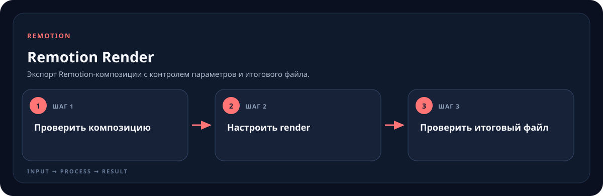

<!-- generated by scripts/generate-skill-overviews.mjs -->

# Remotion Render

Экспорт Remotion-композиции с контролем параметров и итогового файла.

*Схема показывает назначение и ход работы скилла; это не скриншот готового результата.*

**Когда использовать:** Нужно отрендерить видео или отдельный кадр.

**На входе:** Проект, composition ID, формат и параметры экспорта.

**Результат:** Проверенный видеофайл или still.

**Инструкции:** [SKILL.md](SKILL.md)
