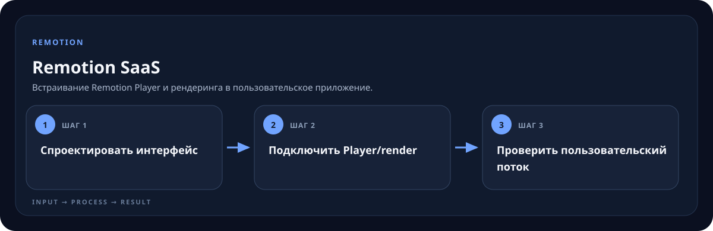

<!-- generated by scripts/generate-skill-overviews.mjs -->

# Remotion SaaS

Встраивание Remotion Player и рендеринга в пользовательское приложение.

*Схема показывает назначение и ход работы скилла; это не скриншот готового результата.*

**Когда использовать:** Строится продукт с видео-preview, параметрами и/или генерацией роликов.

**На входе:** Приложение, UI и сценарий взаимодействия с видео.

**Результат:** Player или render flow внутри приложения.

**Инструкции:** [SKILL.md](SKILL.md)
