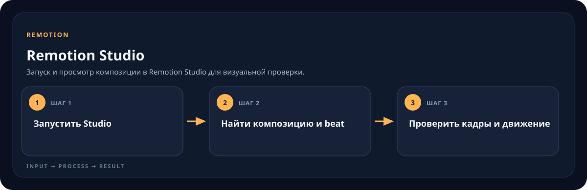

<!-- generated by scripts/generate-skill-overviews.mjs -->

# Remotion Studio

Запуск и просмотр композиции в Remotion Studio для визуальной проверки.

*Схема показывает назначение и ход работы скилла; это не скриншот готового результата.*

**Когда использовать:** Нужно открыть preview и проверить сцену по таймлайну.

**На входе:** Remotion-проект и конкретная композиция.

**Результат:** Рабочий preview и просмотренные кадры/тайминг.

**Инструкции:** [SKILL.md](SKILL.md)
