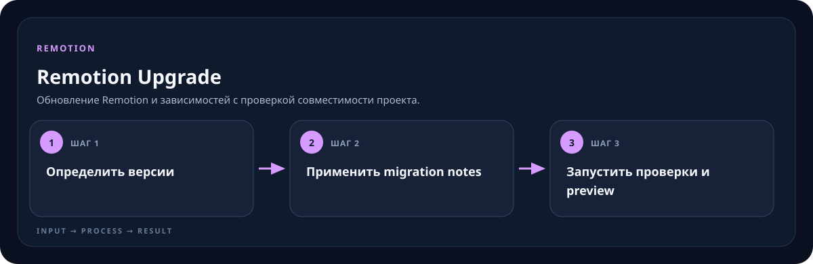

<!-- generated by scripts/generate-skill-overviews.mjs -->

# Remotion Upgrade

Обновление Remotion и зависимостей с проверкой совместимости проекта.

*Схема показывает назначение и ход работы скилла; это не скриншот готового результата.*

**Когда использовать:** Нужно перейти на новую версию Remotion или исправить несовместимости.

**На входе:** Текущая версия, целевая версия и проект.

**Результат:** Обновлённые зависимости и проверенная сборка.

**Инструкции:** [SKILL.md](SKILL.md)
