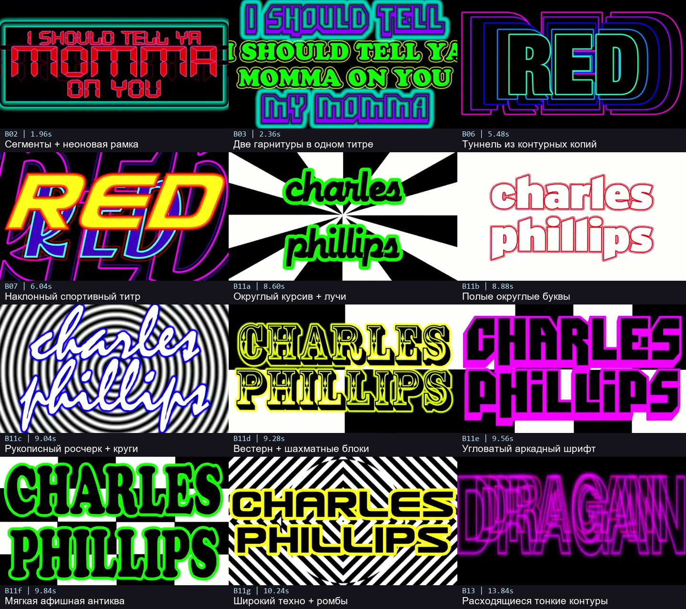

# R2 — первые 16 секунд Remix

Ссылка пользователя: [I Should Tell Ya Momma on You — MARKO DRAGAN ZECEVIC featuring RED](https://www.youtube.com/watch?v=qCvHZwDPmZI).

**Основание разбора:** предоставленный пользователем локальный файл `I Should Tell Ya Momma on You by MARKO DRAGAN ZECEVIC ft. RED (Remix)-1080p.mp4`. Фактически 1280×720, номинально **25 fps**, 171 с. Изучены **0:00–0:16**. YouTube-версия была недоступна; совпадение монтажа с ней отдельно не подтверждено. Таймкоды относятся именно к локальному Remix. Дата фиксации — 9 сентября 2026 года.

Первые 16 секунд: 399 декодированных кадров с PTS 0,04–15,96 с через 0,04 с. Семь переключений B11 проверены по каждому кадру. Остальные диапазоны с `≈` — оценки по выборкам с шагом 0,08–0,12 с. Исходные файлы гарнитур неизвестны.

## Каталог

| Код | Участок локального файла | Что видно | Как превратить в отдельный стиль |
|---|---|---|---|
| **B01** | ≈0,96–1,52 · ≈0,56 с | Маленький тяжёлый гротеск быстро растёт почти до ширины экрана; насыщенная заливка и контрастный контур | Один крупный масштабный удар. Выбрать собственную контрастную пару, не применять эту же подачу к следующим подписям. |
| **B02** | ≈1,88–2,16 · ≈0,28 с | Сегментные электронные буквы, особенно крупное среднее слово, бирюзовая неоновая рамка | Компоновать 2–3 строки разной крупности. Контур букв тонкий, ореол рамки шире. Это отдельный электронный стиль. |
| **B03** | ≈2,16–2,56 · ≈0,40 с | Позади — угловатый заголовок; поверх — широкая декоративная антиква. Несколько контуров и цветной ореол | Намеренно столкнуть две гарнитуры внутри одной короткой подписи. Обе гарнитуры после этого считаются использованными. |
| **B04** | ≈2,88–3,20; ≈7,12–7,68 | Неоновые радиальные фигуры или тонкие лучи за текстом; меняется разбивка строк и выделение среднего слова | Один лучевой акцент с отдельным движением текста и задника. В источнике приём возвращается; у нас выбрать только одно применение. |
| **B05** | ≈4,64–5,48 · ≈0,84 с | Контурное имя поверх накапливающихся красных брызг; заливка появляется и исчезает, положение меняется | Один экспрессивный титр с графическими брызгами и переходом от полых букв к заполненным. Брызги — отдельный рисунок, не деформация шрифта. |
| **B06** | ≈5,48–5,88 · ≈0,40 с | Несколько вложенных контурных копий разного масштаба и цвета | «Туннель» из букв: 3–5 контурных слоёв, разные масштабы, один общий центр. Это не обычная тень. |
| **B07** | ≈5,88–6,16 · ≈0,28 с | Широкий наклонный спортивный гротеск, яркая заливка, двойной контур; большая копия позади | Наклон, плотная посадка букв и резкая крупность. Основной текст остаётся читаемым поверх увеличенного фрагмента. |
| **B08** | ≈6,16–6,80 · ≈0,64 с суммарно | Последовательность декоративной антиквы, пиксельного слоя и широких повторных контуров; горизонтальные полосы | Это несколько состояний, а не один установленный шрифт. Взять одно: декоративный трафарет, растровый срыв или многолинейный контур. |
| **B09** | ≈7,68–8,12 · ≈0,44 с | Контурный трёхстрочный текст получает заливку; позади усиливается светлое пятно | Проявление заливки на фоне локального светового пятна. Не размывать всю фразу одинаково. |
| **B10** | 8,12–8,48; 10,40–10,72 | Крупные короткие служебные слова: тяжёлый гротеск, чёрный фон, контрастный тонкий контур | Резкая короткая вставка между более сложными титрами. В источнике схожая гарнитура повторяется; это одна семья оформления. |
| **B11a–g** | **8,48–10,40 · 1,92 с** | Одна и та же подпись проходит через семь отчётливо разных оформлений | Самый прямой образец переключения стилей при сохранении текста. Точные интервалы — ниже. |
| **B12** | ≈10,72–13,52 | Малое геометрическое имя → большой размытый силуэт → наклонная светящаяся версия → белый логотип с крупной цветной копией → насыщенные однотонные фоны | Взять одну траекторию: «малый резкий текст + огромная размытая копия» либо «наклонный текст с цветным шлейфом». Смена цвета без новой геометрии не считается новым стилем. |
| **B13** | ≈13,52–14,48 · ≈0,96 с | Тонкие полые буквы, несколько расходящихся контурных копий, рост и резкое уменьшение | Контурное эхо с заметным изменением масштаба. Родственно B06 по эффекту: не выбирать оба в одном коротком ролике при строгом запрете повторов. |
| **B14** | ≈14,48–16,00 · ≈1,52 с внутри выборки | Три строки узкого наклонного спортивного шрифта, несколько контуров, постепенное увеличение, резкие смены палитры | Плотный трёхстрочный титр. 16 с — граница выборки; естественное окончание титра не измерено. |

### Семь точных переключений одной подписи

Подпись с именем режиссёра сохраняет содержание в течение **1,92 с / 48 кадров**, но меняет оформление:

| Код | Интервал | Кадры | Внешний вид |
|---|---|---:|---|
| **B11a** | **8,48–8,80** | 8 / 0,32 с | Толстый округлый курсив, цветная обводка, чёрно-белые радиальные клинья. |
| **B11b** | **8,80–9,04** | 6 / 0,24 с | Округлый прямой гротеск, тонкий полый контур, чередование светлой и тёмной карточки, уменьшение. |
| **B11c** | **9,04–9,28** | 6 / 0,24 с | Быстрый рукописный росчерк, толстый контур, концентрические круги на фоне. |
| **B11d** | **9,28–9,56** | 7 / 0,28 с | Декоративная вестерн-антиква с внутренним рисунком, крупные шахматные блоки. |
| **B11e** | **9,56–9,80** | 6 / 0,24 с | Угловатые аркадные прописные, широкая цветная обводка, жёсткая геометрия. |
| **B11f** | **9,80–10,04** | 6 / 0,24 с | Мягкая тяжёлая афишная антиква, округлые засечки, толстый контур. |
| **B11g** | **10,04–10,40** | 9 / 0,36 с | Широкий техно-гротеск, полосатые ромбы, увеличение от очень маленького текста до заполнения кадра. |

В этой серии заливка, контур и фон иногда переключаются **каждые 0,04 с**, хотя сама гарнитура держится 0,24–0,36 с. Это разные уровни частоты. Не задавать длительность чтения фразы в один кадр и не выдавать каждую смену цвета за новый шрифт.

Для адаптации сохранять различие силуэтов и резкость замен. Покадровое чередование чёрного и белого на весь экран не использовать по умолчанию: нужную перемену характера дают сами буквы, локальные контуры и один сменившийся фон.

### Подбор гарнитур R2

Имена исходных файлов шрифтов не подтверждены. Описывать гарнитуры по форме:

- Сегментный электронный: отдельные угловатые штрихи, разрывы на стыках.
- Спортивный: узкие наклонные прописные, срезанные углы, плотная посадка.
- Аркадный: квадратная конструкция и вырезы; не подменять обычным жирным Arial.
- Вестерн: декоративные засечки и внутренние линии.
- Округлая афишная антиква: мягкие толстые формы, визуально близкие к семейству Cooper; это ориентир, не установленное имя шрифта.
- Рукописный: связные буквы и длинные росчерки, отличающиеся от просто наклонённого гротеска.
- Техно: широкие геометрические формы с короткими прямыми участками и скруглёнными углами.

Для русского текста сначала проверить кириллицу конкретного файла. Если её нет, подобрать аналог с тем же силуэтом или сделать нужную надпись отдельной векторной графикой. Не допускать незаметной подстановки системного шрифта.

## Доказательства внутри навыка

- Обзор всего отрезка: [0–4 с](images/r2-overview-1.jpg), [4–8 с](images/r2-overview-2.jpg), [8–12 с](images/r2-overview-3.jpg), [12–16 с](images/r2-overview-4.jpg).
- Покадровая серия титра B11: [1](images/r2-credits-1.jpg), [2](images/r2-credits-2.jpg), [3](images/r2-credits-3.jpg), [4](images/r2-credits-4.jpg).

Листы являются материалом анализа. Для нового ролика реализуй собственный текст и графические слои. **Каталог R2 содержит разобранные рецепты, а не готовую библиотеку компонентов.** B07/B14 относятся к близкой спортивной семье; B06/B13 — к контурному эху; B01/B10 могут повторять тяжёлый гротеск A05 из [R1](max0r.md).
