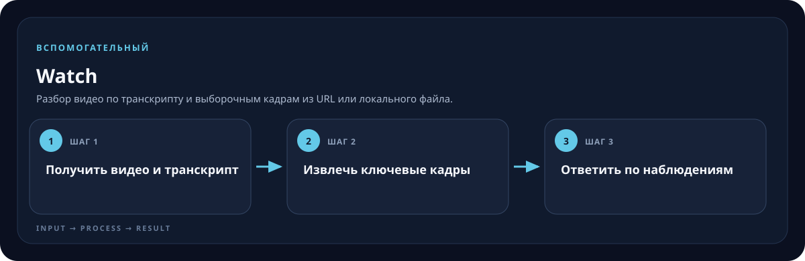

<!-- generated by scripts/generate-skill-overviews.mjs -->

# Watch

Разбор видео по транскрипту и выборочным кадрам из URL или локального файла.

*Схема показывает назначение и ход работы скилла; это не скриншот готового результата.*

**Когда использовать:** Нужно ответить на вопрос о содержании ролика.

**На входе:** URL/файл видео и вопрос пользователя.

**Результат:** Краткий ответ с опорой на речь и выбранные кадры.

**Инструкции:** [SKILL.md](SKILL.md)
